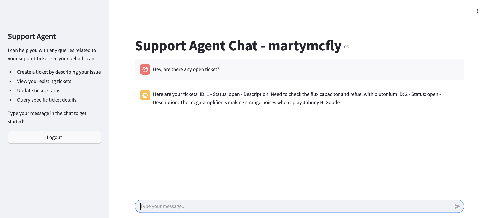

# Description
Launches a demo support bot (`support_agent.py`) that runs on 01 and is connected to the demo ticketing API (`ticketflow_api.py`).

Supported functions:
- Create a ticket for a user.
- List all tickets for a user.
- Update a ticket by ID.
- Query a ticket by ID.

The bot uses hardcoded users:
```python
                {"first_name": "Marty", "last_name": "McFly", "username": "martymcfly", "password": "Password1"},
                {"first_name": "Doc", "last_name": "Brown", "username": "docbrown", "password": "flux-capacitor-123"},
                {"first_name": "Biff", "last_name": "Tannen", "username": "bifftannen", "password": "Password3"},
                {"first_name": "George", "last_name": "McFly", "username": "georgemcfly", "password": "Password4"}
```

# Running
To run the agent, first specify OpenAI API key as an environment variable:
```shell
OPENAI_API_KEY=<your-openai-key>
```

The next step is to launch the agent by running:
```shell
docker-compose up --build
```

This command will run the API server on port 8000 and the agent on port 8001.

# Usage
1. Open the UI on port 8501.
2. Login using one of the initial users.
3. Talk to the agent.


